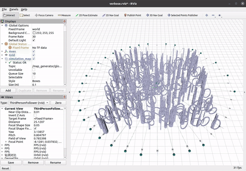

# Primitive_Planner

## Paper

Primitive-Swarm: An Ultra-lightweight and Scalable Planner for Large-scale Aerial Swarms, Accepted by T-RO. [Arxiv](https://arxiv.org/abs/2502.16887)

Author list: Jialiang Hou, Xin Zhou, Neng Pan, Ang Li, Yuxiang Guan, Chao Xu, Zhongxue Gan, Fei Gao

## Requirements

The code is tested on clean Ubuntu 20.04 with ROS noetic installation.

Install the required package toppra:

```bash
sudo pip3 install toppra catkin_pkg PyYAML empy matplotlib pyrfc3339
```

## Run the code

### 1. Download and compile the code

```bash
git clone https://github.com/ZJU-FAST-Lab/Primitive-Planner.git
cd Primitive-Planner
catkin_make -DCMAKE_BUILD_TYPE=Release
```

### 2. Generate the motion primitive library

```bash
cd src/scripts
python3 swarm_path.py
```

The generated motion primitive library is stored in "src/planner/plan_manage/primitive_library/".

### 3. Run the planner

In the "Primitive-Planner/" directory:

```bash
source devel/setup.bash # or setup.zsh
cd src/scripts
python3 gen_position_swap.py 20 # It will generate the swarm.launch with 20 drones
roslaunch primitive_planner swarm.launch
```

Wait until all the nodes have their launch process finished and keep printing "[FSM]: state: WAIT_TARGET. Waiting for trigger".

Open another terminal, publish the trigger

```bash
cd src/scripts
bash pub_trigger.sh
```

Then the drones (drone number is 40) will start to fly like this
<p align = "center">

</p>

Change the drone number when executing "python3 gen_position_swap.py <drone_number>".

Before starting the "roslaunch" command, please open another terminal and run "htop" to monitor the Memory usage and CPU usage. Each drone requires about 200 MB memory. Keep the htop opened for entire flight.

The computation time is printed on the terminal in blue text, named as "plan_time".
To get the accurate computation time, please fix the CPU frequency to its maximum by

```bash
sudo apt install cpufrequtils
sudo cpufreq-set -g performance
```

Otherwise the CPU will run in powersave mode with low frequency.

## Docker development setup

If you don't want to install the whole ros setup on your local machine you can build and run the environment in a docker container.

### Build container

Within the root folder of this repo execute the following command to build the docker container.

```bash
docker build \
  --build-arg USER_ID=$(id -u) \
  --build-arg GROUP_ID=$(id -g) \
  -t primitive-planner .
```

### Run container

After the build as succeeded you can run the `docker_run.sh` file to start the container. (If you get a permission denied error you need to add the execution permission to the file with `chmod +x docker_run.sh`)

Now you can proceed with the second command of [step 1](#1-download-and-compile-the-code) (you can skip the first since you already cloned the repo).

### Connect to a running container

If you want to get into the running container at a later stage or with a second terminal execute

```bash
docker exec -it primitive-planner bash
```

### Troubleshooting
rviz might fail with the following error: `libGL error: MESA-LOADER: failed to retrieve device information`. Consequently, no rviz window will appear. This can be solved by adding the following option to `docker run` in `docker_run.sh`:

```diff
     --name="primitive-planner" \
+    --device=/dev/dri:/dev/dri \
     primitive-planner
```
(at least this works on Arch Linux)
