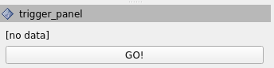
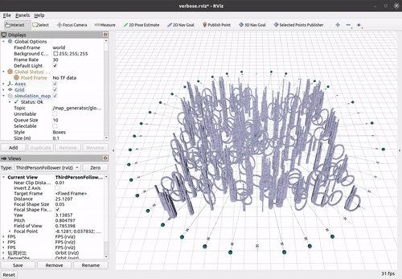

# Primitive_Planner

## Paper

Primitive-Swarm: An Ultra-lightweight and Scalable Planner for Large-scale Aerial Swarms, Accepted by T-RO. [Arxiv](https://arxiv.org/abs/2502.16887)

Author list: Jialiang Hou, Xin Zhou, Neng Pan, Ang Li, Yuxiang Guan, Chao Xu, Zhongxue Gan, Fei Gao

## Environment Setup

This project supports two environment setups: direct installation on Ubuntu 20.04 with ROS Noetic, or a containerized setup using Docker.

1. **Native installation** on Ubuntu 20.04 with ROS Noetic.
2. **Docker container** for an isolated, ready-to-use environment.

### Native Installation (Ubuntu 20.04 + ROS Noetic)

1. **Install ROS Noetic**  
   Follow the instructions from the [official ROS Noetic installation guide](http://wiki.ros.org/noetic/Installation/Ubuntu).

2. **Install Python dependencies**

   ```bash
   sudo pip3 install toppra catkin_pkg PyYAML empy matplotlib pyrfc3339
   ```

### Docker development setup

If you don't want to install the whole ros setup on your local machine you can build and run the environment in a docker container.

1. **Clone this Repo**

     First you have to clone this repo to your local machine.

2. **Build container**

     Within the root folder of this repo execute the `docker_build.sh` file to build the docker container. (If you get a permission denied error you need to add the execution permission to the file with `chmod +x docker_build.sh`)

3. **Run container**

     After the build as succeeded you can run the `docker_run.sh` file to start the container.

     Now you can proceed with the second command of [step 1](#1-download-and-compile-the-code) (you can skip the first since you already cloned the repo).

4. **Connect to a running container**

     If you want to get into the running container at a later stage or with a second terminal execute

     ```bash
     docker exec -it primitive-planner bash
     ```

## Run the code

### 1. Download and compile the code

```bash
git clone https://github.com/ZJU-FAST-Lab/Primitive-Planner.git
cd Primitive-Planner
catkin_make -DCMAKE_BUILD_TYPE=Release
```

### 2. Generate the motion primitive library

```bash
cd src/scripts
python3 swarm_path.py
```

The generated motion primitive library is stored in "src/planner/plan_manage/primitive_library/".

### 3. Run the planner

In the "Primitive-Planner/" directory:

```bash
source devel/setup.bash # or setup.zsh
cd src/scripts
python3 gen_position_swap.py 20 # It will generate the swarm.launch with 20 drones
roslaunch primitive_planner swarm.launch
```

Wait until all the nodes have their launch process finished and keep printing "[FSM]: state: WAIT_TARGET. Waiting for trigger".

Then you can send the trigger command by clicking on the GO button in the trigger panel.
<p align = "center">

</p>

Then the drones (drone number is 40) will start to fly like this
<p align = "center">

</p>

Change the drone number when executing "python3 gen_position_swap.py <drone_number>".

Before starting the "roslaunch" command, please open another terminal and run "htop" to monitor the Memory usage and CPU usage. Each drone requires about 200 MB memory. Keep the htop opened for entire flight.

The computation time is printed on the terminal in blue text, named as "plan_time".
To get the accurate computation time, please fix the CPU frequency to its maximum by

```bash
sudo apt install cpufrequtils
sudo cpufreq-set -g performance
```

Otherwise the CPU will run in powersave mode with low frequency.

### 4. Run the other examples

There are a few more examples you can run:

1. Decentralized goal flight without obstacles
2. Decentralized goal flight with obstacles
3. Tele-Operator mode (virtual heading flight)

### Decentralized goal flight without obstacles

To run this example you can generate the launch file with

```bash
cd src/scripts
python3 gen_decentralized_goal_flight.py 10 # This will generate a launch file with 10 drones
```

and then launch the simulation with

```bash
roslaunch primitive_planner decentralized_goal_flight.launch
```

You can publish a goal by clicking on the "3D Nav Goal" button and the selecting a point in the simulation.

<p align = "center">

</p>

Initially, only drone 0 is set to receive the goal message. To modify this, click "Select Points Publisher", select the drones you want to sent the message to, and confirm your selection by pressing `Shift + P`. The "3D Nav Goal" will now be published to the drones you selected. Remember if the drones are in local communication range they will forward the goal to each other. If they are fully connected (like at the start of the scenario) then its sufficient to send the goal to only one drone.

### Decentralized goal flight with obstacles

To launch this example just run:

```bash
roslaunch primitive_planner traverse_forest.launch
```

Now you can publish a "3d Nav Goal" to the drones as it was described in the section above.

### Tele-Operator mode (virtual heading flight)

To run the virtual heading flight first generate the launch file with:

```bash
cd src/scripts
ppython3 gen_teleop_heading_flight.py 10 # This will generate a launch file with 10 drones
```

Then you can run the simulation with:

```bash
roslaunch primitive_planner teleop_heading.launch
```

Open a second terminal and run:

```bash
rosrun teleop_twist_keyboard teleop_twist_keyboard.py
```

You can now send heading commands as described in the console instructions.

If you're running this inside a Docker container, refer to the Docker section for instructions on how to attach to a running container.

## Development (in progress)

Here are some useful tips to get you started:

### Code Formatting

Please use clang-format with the provided `.clang-format` style file for c++ files and `black-formatter` for python files. This keeps purely formatting changes isolated, so code reviews can focus on functional updates.

If you are working with vscode you can add the following lines to your `settings.json`:

```json
"[cpp]": {
     "editor.defaultFormatter": "xaver.clang-format"
},
"[python]": {
     "editor.defaultFormatter": "ms-python.black-formatter"
},
"[xml]": {
     "editor.defaultFormatter": "redhat.vscode-xml",
},
"xml.format.maxLineWidth": 0,
"xml.format.spaceBeforeEmptyCloseTag": false,

"editor.formatOnSave": true
```

### Slow Down Simulation Time

If you want to debug or if your computer is not powerful enough you can slow down the simulation time using the `clock_publisher`. An example launch config can be found in `src/Utils/clock_publisher/launch`.

## Troubleshooting

rviz might fail with the following error: `libGL error: MESA-LOADER: failed to retrieve device information`. Consequently, no rviz window will appear. This can be solved by adding the following option to `docker run` in `docker_run.sh`:

```diff
     --name="primitive-planner" \
+    --device=/dev/dri:/dev/dri \
     primitive-planner
```

(at least this works on Arch Linux)